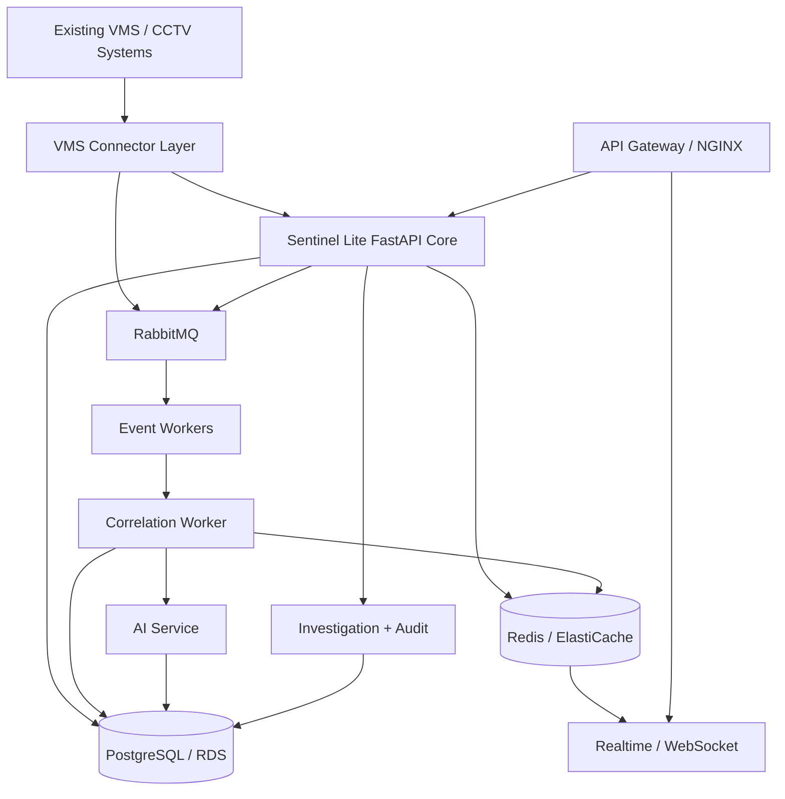

# Sentinel Lite Backend Architecture

## 1. Architectural intent

Sentinel Lite is a **middleware/federation system**, not a replacement VMS. Existing departmental systems remain authoritative for their source video infrastructure while Sentinel maintains a normalized operational view.

## 2. Logical architecture



## 3. Planes

### Control plane
Users, departments, VMS registration, cameras, permissions, investigations and audit.

### Data plane
Camera status, normalized events, AI detections and realtime state changes.

### Processing plane
Message consumption, normalization, correlation, AI orchestration and candidate generation.

## 4. Deployment topology

```text
Internet
  ↓
API Gateway / NGINX
  ↓
ECS/Fargate or EC2
  ├── FastAPI API
  ├── Event Worker
  └── Correlation Worker
       ├── RDS PostgreSQL
       ├── ElastiCache Redis
       └── RabbitMQ
```

The exact managed RabbitMQ deployment is an infrastructure decision. The application should depend on the RabbitMQ interface, not on a deployment-specific topology.

## 5. Backend modules

```text
app/
├── api/
├── core/
├── models/
├── schemas/
├── services/
├── connectors/
├── events/
├── ai/
├── investigation/
└── db/
```

## 6. Boundary rules

1. API routers validate and authorize; they do not contain large business workflows.
2. Services contain domain operations.
3. ORM models represent persistence; API schemas represent contracts.
4. Connector code translates external formats into canonical domain objects.
5. Workers own long-running asynchronous work.
6. PostgreSQL is the source of truth for durable business state.
7. Redis is for cache/realtime/transient state, not the authoritative investigation record.
8. RabbitMQ is for durable asynchronous processing.
9. AI is accessed through a contract, not hard-coded into every event handler.

## 7. Why modular monolith + workers

For a hackathon, one well-factored FastAPI application plus isolated workers gives most of the architectural benefits needed without the deployment cost of many microservices. Modules remain separable enough to extract later if actual scale requires it.
